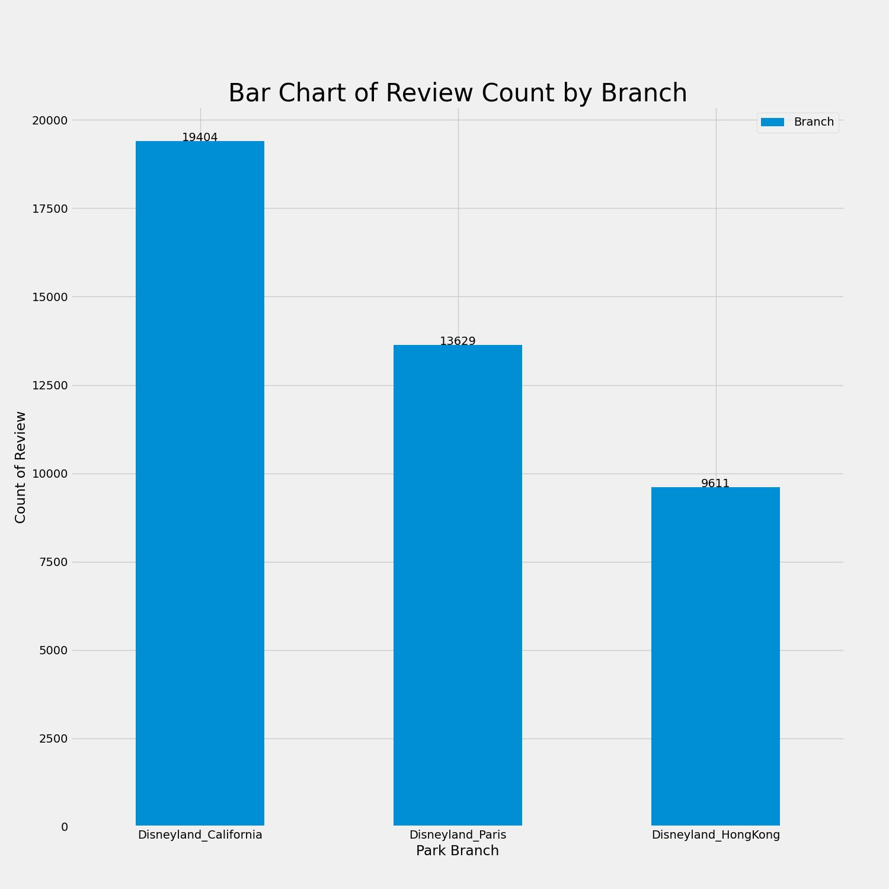
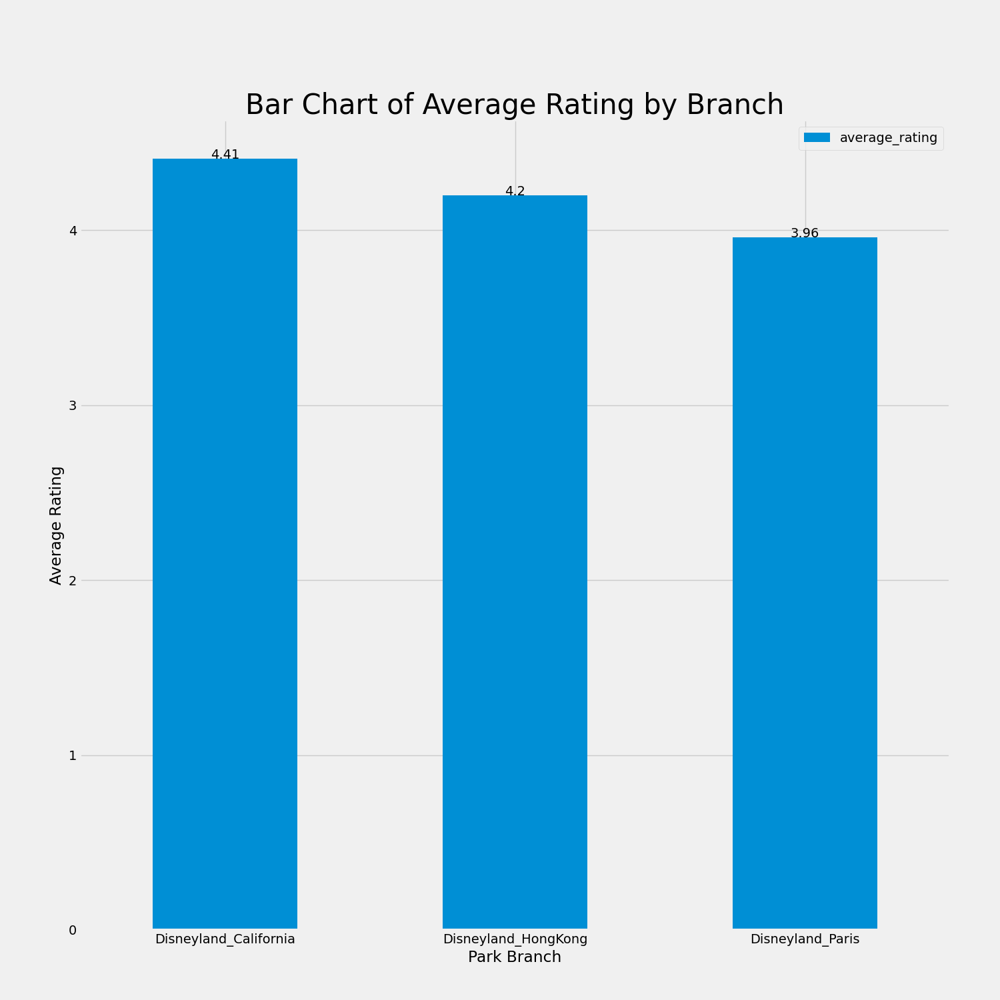
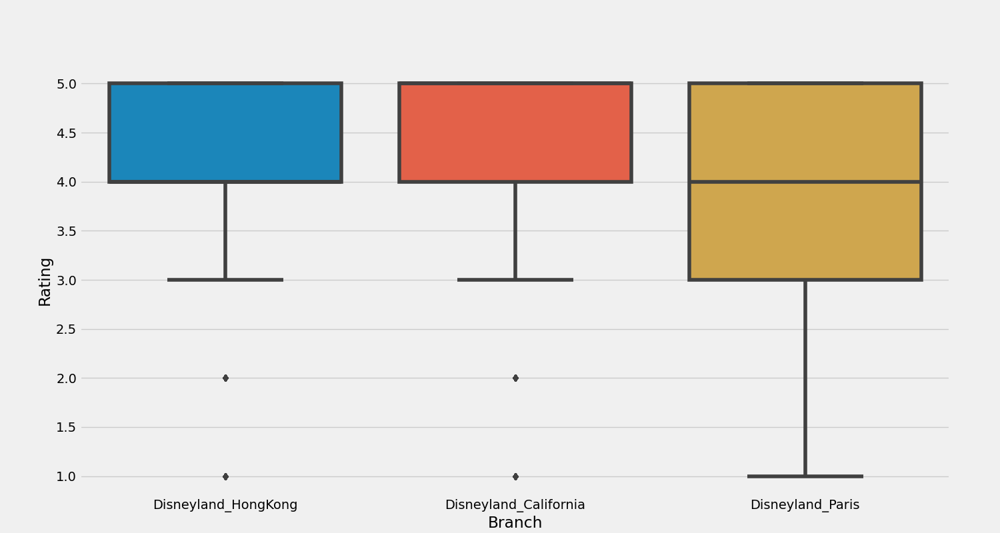
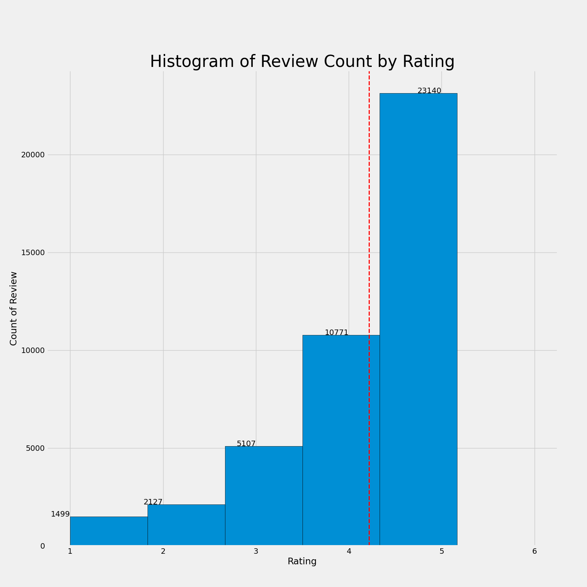
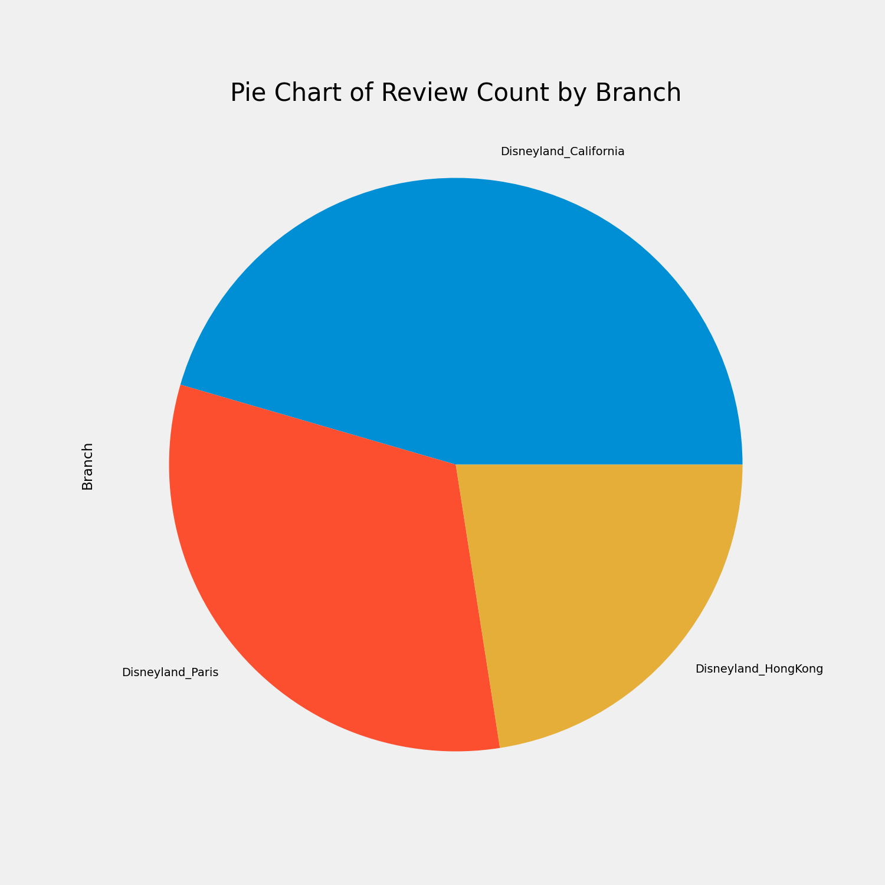
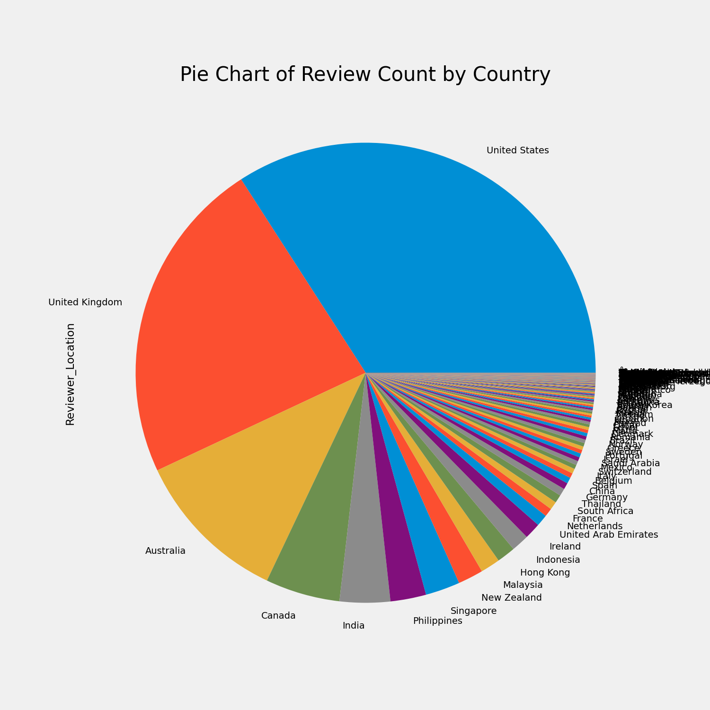
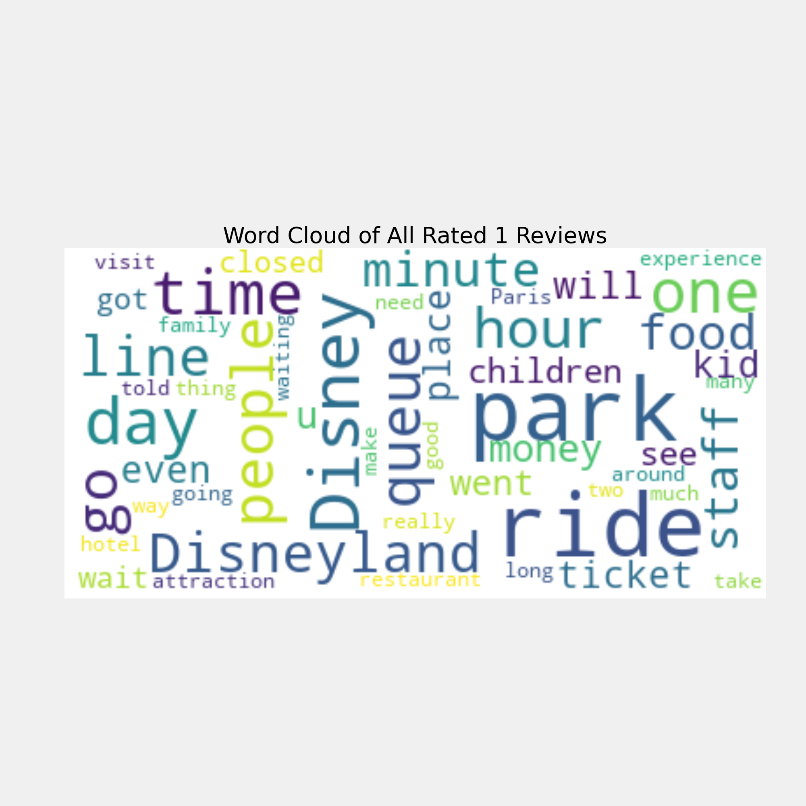

# Disneyland Reviews EDA

## Table of Contents
- [Bar Charts](#bar-charts)
- [Box Plot](#box-plot)
- [Histogram](#histogram)
- [Line Chart](#line-chart)
- [Pie Charts](#pie-charts)
- [Word Clouds](#word-clouds)

## Bar Charts
Bar charts representing various data points.

### Branch

### Location

### Month

### AVG Rate by Branch

### Year

## Box Plot
Box plot representing the distribution.

## Histogram
Histogram representing reviews.

## Line Chart
Line chart showing a trend over time.

## Pie Charts
Pie charts representing various divisions.

### Review by Branch

### Review by Country

## Word Clouds
Word clouds representing positive and negative sentiments.

### Negative Sentiments

### Positive Sentiments

